# 基于springboot的个人博客系统

---
### 👉作者QQ ：1556708905 微信：zheng0123Long (支持定制修改、部署调试、定制毕设)

### 👉接网站建设、小程序、H5、APP、各种系统等

---

#### 介绍

个人博客系统是一个基于Spring Boot框架开发的网络平台，旨在为个人博主提供一个发布和管理自己文章的平台，同时也为管理员提供全面的系统管理功能。该系统背景是为了满足日益增长的个人表达和知识分享的需求，使博主能够轻松发布和管理自己的内容，并通过系统公告和分类管理提高博客的组织性和可访问性。系统通过角色划分，实现了博主和管理员的分工协作，确保博客的内容质量和系统的正常运行。

#### 技术栈

后端技术栈：Springboot+Mysql+Maven

前端技术栈：Vue+Html+Css+Javascript+ElementUI

开发工具：Idea+Vscode+Navicate

#### 系统功能介绍

管理员功能模块  
个人中心：管理员可以查看和修改个人信息，设置系统偏好，查看系统通知和消息。  
用户管理：管理员可以管理系统中所有用户的信息，包括添加、修改和删除用户。  
博主管理：管理系统中的博主账号信息，包括博主的注册、审核和权限分配。  
文章分类管理：管理员可以创建、修改和删除文章分类，帮助博主对文章进行有效分类。  
博主文章管理：管理员可以查看、审核和管理博主发布的所有文章，确保文章内容的质量和合法性。  
系统管理：管理员可以设置系统参数，管理系统公告，查看系统日志，确保系统的正常运行和安全。  

博主功能模块  
博主文章：博主可以查看和管理自己发布的文章，进行编辑、删除和分类操作。  
系统公告：博主可以查看管理员发布的系统公告，了解系统的最新动态和重要通知。  
个人中心：博主可以查看和修改个人信息，设置系统偏好，查看个人消息。  
后台管理  
博主管理：博主可以查看自己的权限和状态，申请修改个人权限。  
博主文章管理：博主可以发布新文章，编辑和删除已有文章，管理文章的分类和标签。  

#### 系统作用

个人博客系统在个人表达、知识分享和系统管理中起到了重要作用，主要体现在以下几个方面：

支持个人表达：系统为博主提供了一个便捷的发表文章的平台，使个人能够轻松分享自己的知识和观点。

提高内容组织性：通过文章分类和标签管理，使博主的文章更加有序，便于读者查找和阅读。

增强互动性：系统公告功能使博主能够及时了解系统的最新动态和重要信息，增强了管理员和博主之间的互动。

确保内容质量：管理员对博主文章的审核功能，确保了发布内容的质量和合法性，提升了博客平台的整体水平。

简化管理流程：通过系统管理和日志查看功能，管理员能够高效地管理系统和用户，确保系统的正常运行和安全。

#### 系统功能截图

代码结构

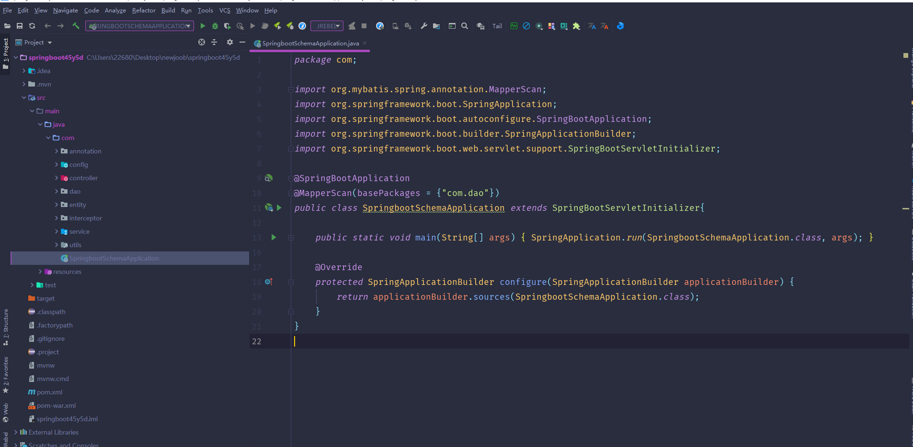

数据库表

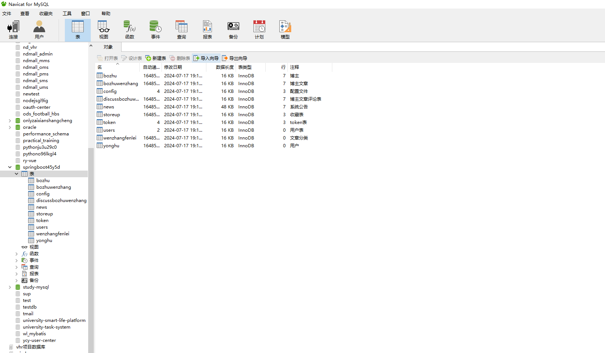

登录

前台页面首页

博主文章模块

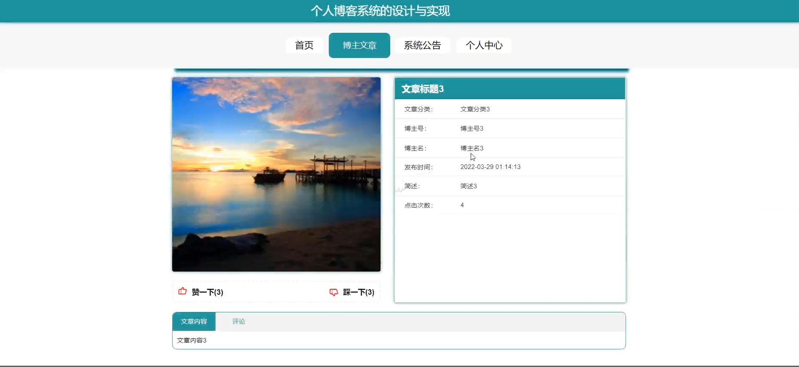

系统公告

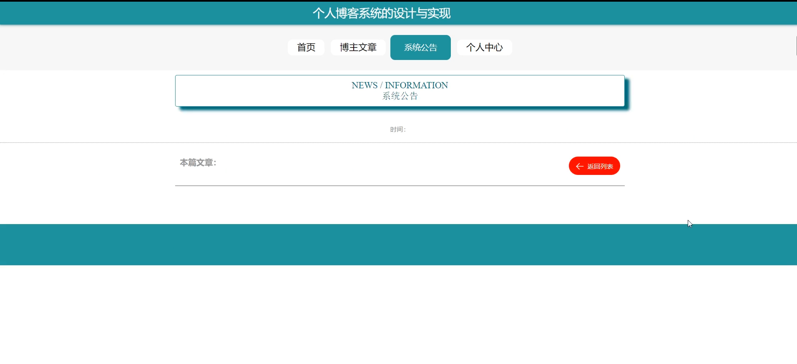

个人中心

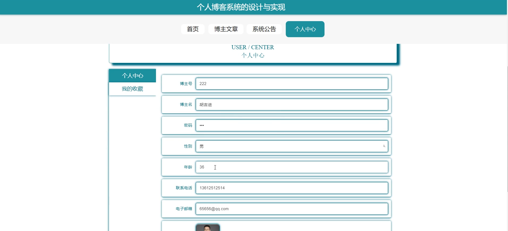

管理员端用户管理

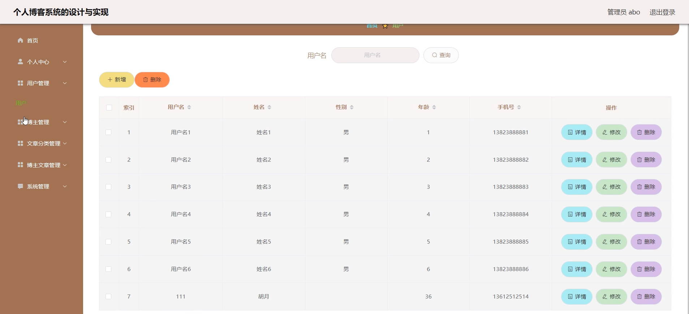

文章分类管理

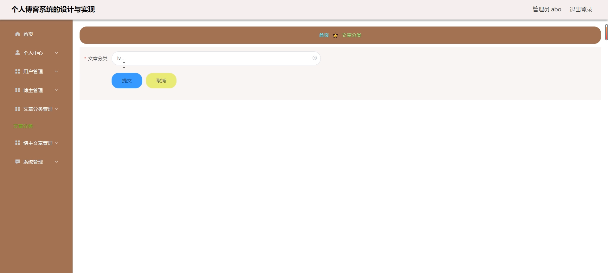

博主文章管理

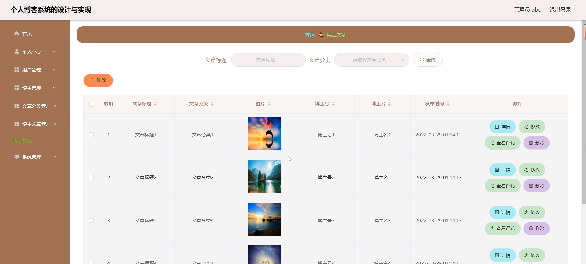

系统管理

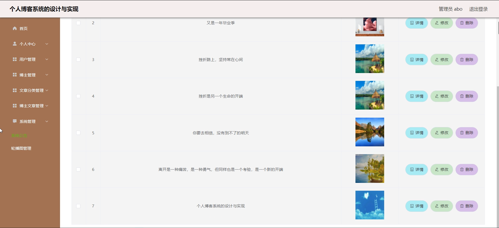

博主文章管理

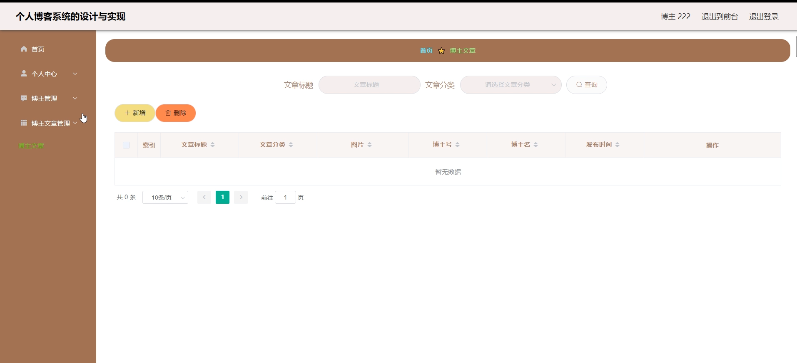

博主管理

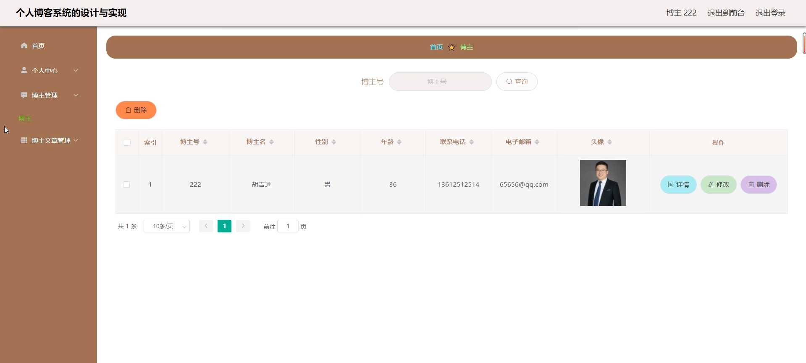

#### 总结

个人博客系统的开发旨在满足个人博主发布和管理文章的需求，同时为管理员提供全面的系统管理功能。系统通过角色划分，实现了博主和管理员的分工协作，确保了博客的内容质量和系统的正常运行。系统提供了丰富的功能模块，涵盖了个人博客管理的各个方面，满足了博主和管理员的不同需求。通过信息化手段，系统提升了博客管理的效率和质量，为个人表达和知识分享提供了坚实的保障。未来，系统将不断优化和升级，进一步提升用户体验，推动个人博客管理的现代化进程。

#### 使用说明

创建数据库，执行数据库脚本 修改jdbc数据库连接参数 下载安装maven依赖jar 启动idea中的springboot项目

后台地址
http://localhost:8080/springboot45y5d/admin/dist/index.html

管理员  abo 密码 abo

前台地址：http://localhost:8080/springboot45y5d/front/index.html